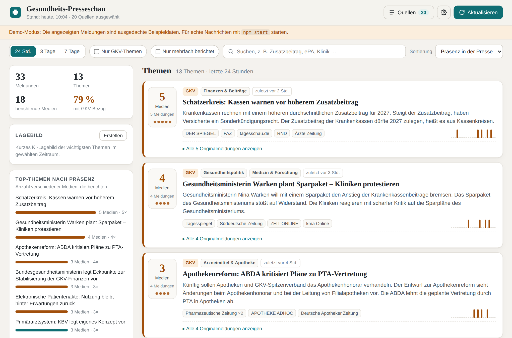

# Gesundheits-Presseschau

Lokales Web-Dashboard, das Meldungen deutscher Medien mit Bezug zur **Gesundheitsbranche** sammelt – mit besonderem Augenmerk auf die **gesetzliche Krankenversicherung (GKV)**. Ähnliche Meldungen werden zu Themen gebündelt, sodass sofort sichtbar ist, **wie viele Medien** über ein Thema berichten. Jede Themengruppe enthält die Links zu allen Originalmeldungen und eine Zusammenfassung.



## Funktionen

- **Quellen-Dialog:** 30+ deutsche Medien in fünf Gruppen (Leitmedien, Wirtschaft, Öffentlich-rechtlich/Regional, Fachmedien Gesundheit, Politik/Selbstverwaltung/Kassen) per Häkchen wählbar – mit Status des letzten Abrufs. Eigene Quellen (RSS-Feed oder Domain) lassen sich ergänzen.
- **Themenfilter Gesundheit/GKV:** Eine gewichtete Stichwortbewertung (≈150 Begriffe, von *Zusatzbeitrag* über *Krankenhausreform* bis *E-Rezept*) filtert gesundheitsrelevante Meldungen heraus und markiert GKV-Bezug gesondert.
- **Clustering:** Ähnliche Meldungen werden per TF-IDF und Average-Linkage-Clustering zu Themen gruppiert (Komposita wie *Krankenkassenbeiträge* werden berücksichtigt). Die Schärfe ist in den Einstellungen regelbar.
- **Präsenz in der Presse:** Jede Themenkarte zeigt die Zahl der berichtenden Medien, die Zahl der Meldungen und einen Zeitverlauf. Eine Seitenleiste zeigt die Top-Themen als Balken und die Verteilung auf Themenfelder.
- **Zusammenfassungen:**
  - ohne KI: die zentralsten Sätze aus den Teasern (extraktiv, kostenlos, offline),
  - mit KI (optional): Überschrift, 2–4 Sätze Zusammenfassung und eine **Einschätzung der GKV-Relevanz** – über Anthropic Claude, OpenAI oder ein lokales Ollama-Modell. Dazu ein **Lagebild** auf Knopfdruck.
- **Zeitraum** 24 Stunden / 3 Tage / 7 Tage, Filter „Nur GKV-Themen“ und „Nur mehrfach berichtet“, Volltextsuche, Sortierung.
- **Automatische Aktualisierung** alle 15 Minuten; Meldungen werden 8 Tage lokal vorgehalten, damit auch die 7-Tage-Sicht vollständig ist.
- **Keine Abhängigkeiten:** reines Node.js, kein `npm install` nötig. Heller und dunkler Modus, mobil nutzbar.

## Schnellstart

Voraussetzung: [Node.js](https://nodejs.org) ab Version 18 (empfohlen 20 oder 22).

```bash
git clone https://github.com/v9zd9h4g2k-cmd/gesundheits-news-dashboard.git
cd gesundheits-news-dashboard
npm start
```

Dann im Browser **http://localhost:3000** öffnen. Beim ersten Start werden die Feeds abgerufen (dauert einige Sekunden).

Nur ausprobieren, ohne Internetzugriff: `npm run demo` – startet mit ausgedachten Beispieldaten.

## KI-Zusammenfassungen einrichten (optional)

Entweder im Dashboard über das Zahnrad (⚙) → *KI-Zusammenfassung*: Anbieter wählen und API-Key eintragen. Der Key wird nur lokal in `data/settings.json` gespeichert.

Oder per `.env`-Datei:

```bash
cp .env.example .env
# dann in .env eintragen, z. B.:
ANTHROPIC_API_KEY=sk-ant-...
```

| Anbieter | Standardmodell | Hinweis |
|---|---|---|
| Anthropic Claude | `claude-haiku-4-5-20251001` | schnell und günstig; Modell über `LLM_MODEL` oder im Dialog änderbar |
| OpenAI | `gpt-4.1-mini` | Modellname ggf. an dein Konto anpassen |
| Ollama (lokal) | `llama3.1` | läuft komplett auf deinem Rechner, `ollama pull llama3.1` vorher |

Zusammenfassungen werden je Themengruppe zwischengespeichert (`data/summaries.json`) und nur neu erzeugt, wenn neue Meldungen hinzukommen. Es werden nur die gerade sichtbaren Themen zusammengefasst.

## Konfiguration

| Variable | Standard | Bedeutung |
|---|---|---|
| `PORT` | `3000` | Port des Webservers |
| `HOST` | `127.0.0.1` | `0.0.0.0` macht das Dashboard im Heimnetz erreichbar |
| `REFRESH_MINUTES` | `15` | Intervall für den automatischen Feed-Abruf |
| `LLM_PROVIDER` | `auto` | `auto`, `anthropic`, `openai`, `ollama`, `none` |
| `LLM_MODEL` | – | überschreibt das Standardmodell |
| `DATA_DIR` | `./data` | Speicherort für Einstellungen, Artikel und Zusammenfassungen |

## Quellen und Feeds

Die Standardquellen stehen in [`src/sources.js`](src/sources.js). Für Medien ohne passenden RSS-Feed (z. B. GKV-Spitzenverband, vdek, Tagesspiegel Background) sucht die **Google-News-Ergänzung** gezielt nach Gesundheits- und GKV-Artikeln der jeweiligen Domain. Sie ist standardmäßig aktiv und lässt sich im Quellen-Dialog abschalten.

Medien ändern ihre Feed-Adressen gelegentlich. Mit

```bash
npm run check-feeds             # alle RSS-Feeds prüfen
npm run check-feeds -- --google # zusätzlich die Google-News-Suche
```

siehst du, welche Feeds erreichbar sind. Nicht erreichbare Feeds werden im Quellen-Dialog rot markiert; eine korrigierte Adresse kannst du in `src/sources.js` eintragen oder als eigene Quelle hinzufügen.

## So funktioniert es

```
RSS/Atom-Feeds + Google-News-Suche  →  Speicher (8 Tage, data/articles.json)
        →  Relevanzbewertung Gesundheit / GKV (src/relevance.js)
        →  Clustering ähnlicher Meldungen (src/cluster.js)
        →  Zusammenfassung: extraktiv oder KI (src/summarize.js)
        →  Dashboard im Browser (public/)
```

- **Relevanz:** Treffer im Titel zählen doppelt. Für reine Gesundheits-Feeds (z. B. Ärzteblatt) genügt ein schwächerer Bezug als für allgemeine Nachrichten-Feeds.
- **Präsenz:** Sortiert wird nach `3 × Anzahl Medien + Anzahl Meldungen` (+ Bonus für GKV-Bezug) – ein Thema, über das viele verschiedene Medien berichten, steht oben.
- **Duplikate:** Dieselbe Meldung aus RSS und Google News wird zusammengeführt; Tracking-Parameter werden aus Links entfernt.

## Projektstruktur

```
server.js            HTTP-Server und API
src/sources.js       Standardquellen und Feeds
src/feeds.js         Abruf und Parsing von RSS/Atom (ohne Bibliotheken)
src/relevance.js     Stichwortbewertung Gesundheit/GKV und Themenfelder
src/cluster.js       TF-IDF, Clustering, extraktive Zusammenfassung
src/summarize.js     KI-Anbindung (Anthropic, OpenAI, Ollama) mit Cache
src/news.js          Abruf-Steuerung, Speicher, Auswertung
src/demo-data.js     Beispieldaten für npm run demo
public/              Oberfläche (HTML, CSS, JavaScript)
scripts/check-feeds.js  Feed-Prüfung
test/                Tests (npm test)
```

## Hinweise

- Das Dashboard zeigt nur Titel, Teaser und Links aus den öffentlichen Feeds; die vollständigen Artikel liegen bei den Medien (teils hinter Bezahlschranken).
- Alle Daten bleiben lokal im Ordner `data/` (von Git ausgeschlossen).
- Die KI-Zusammenfassungen basieren auf den Teasern der Meldungen und können Fehler enthalten – im Zweifel die Originalmeldung lesen.
